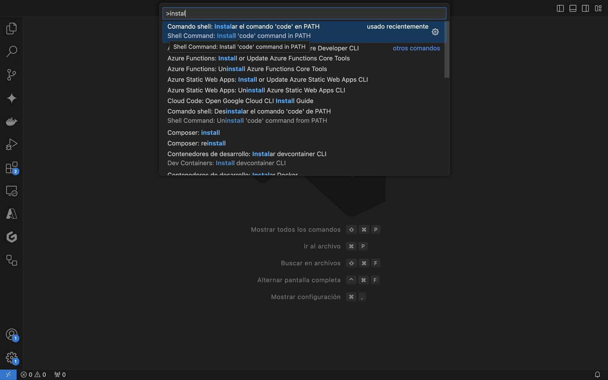
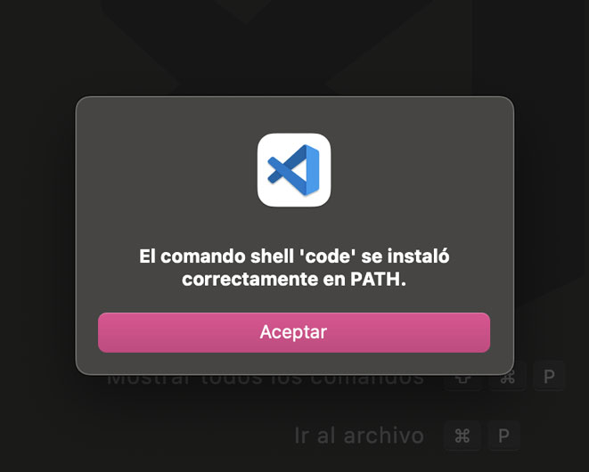
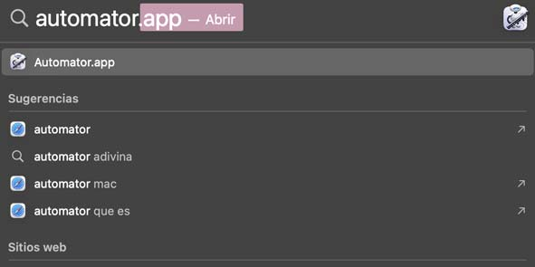
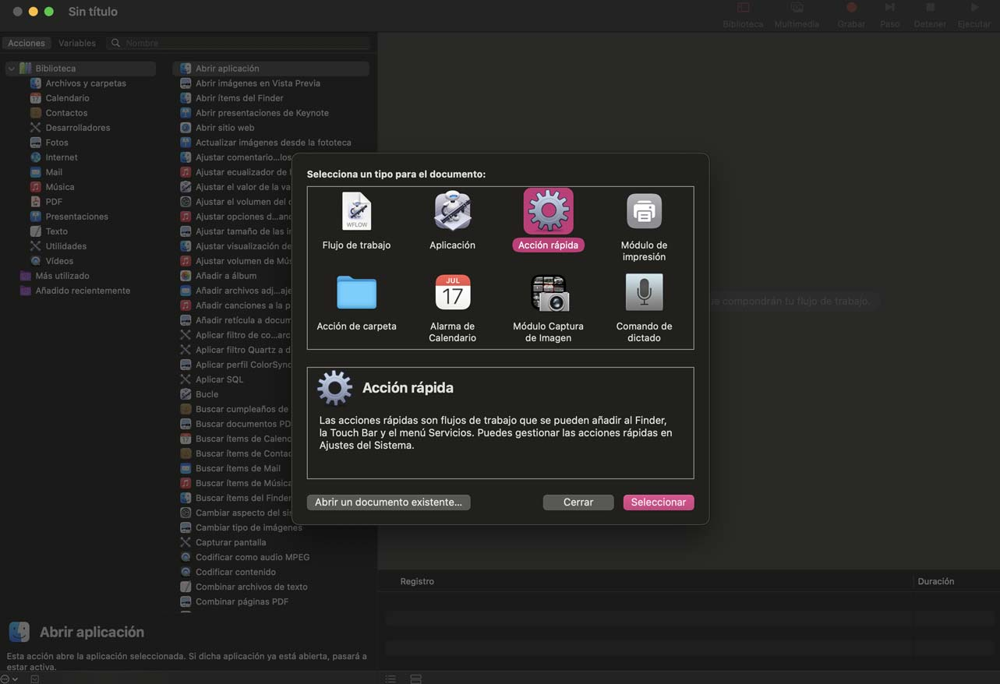
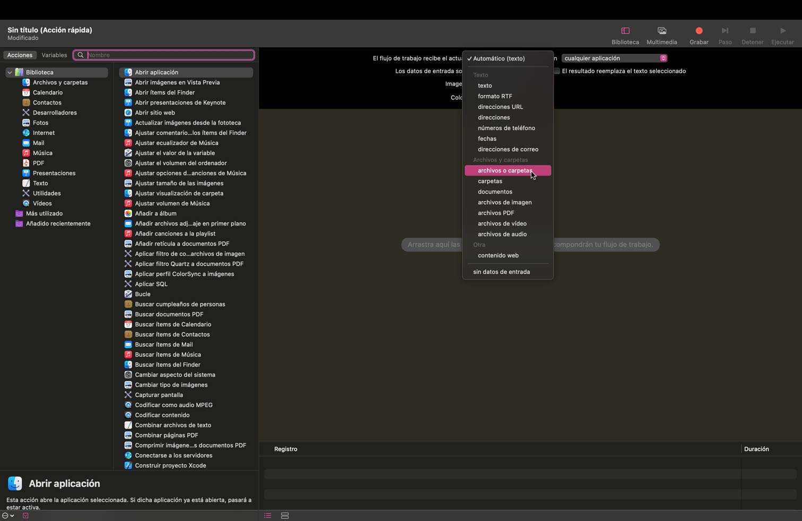
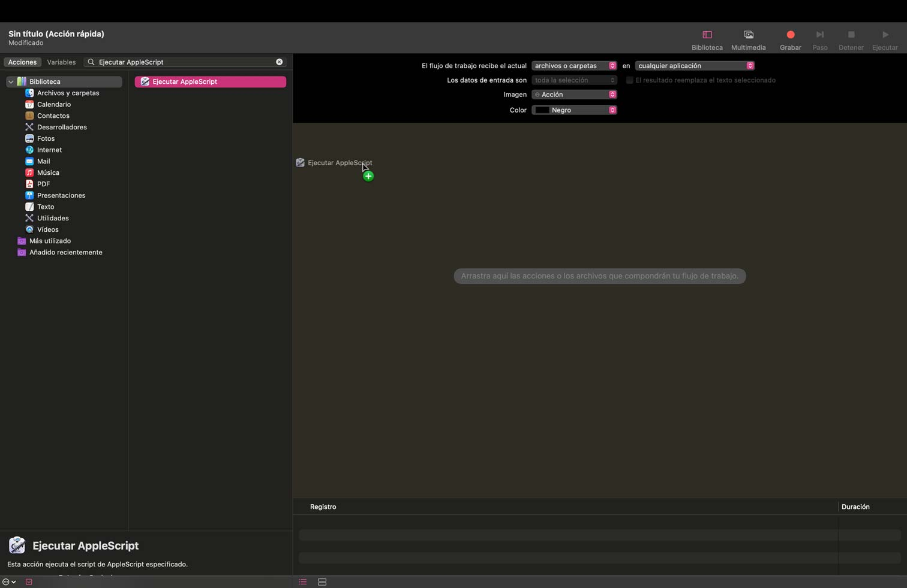
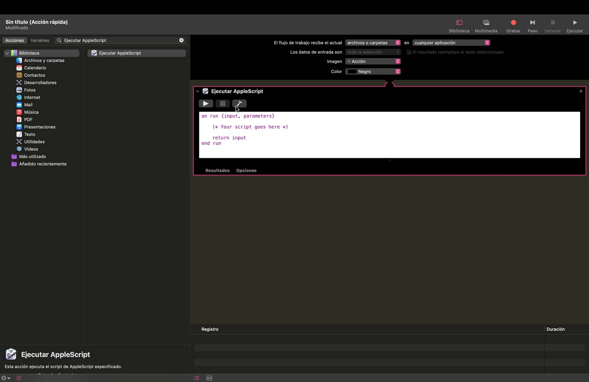
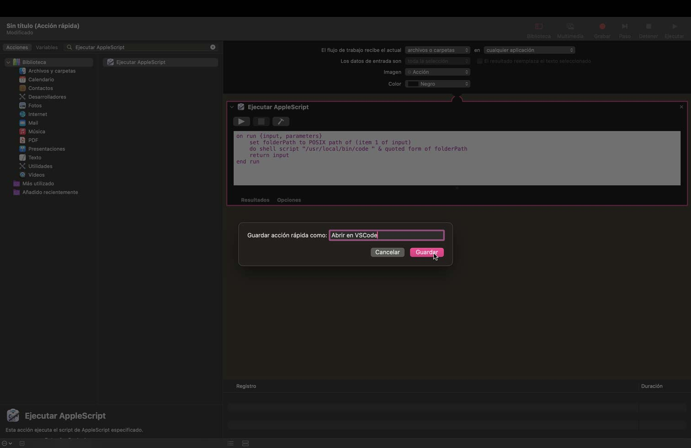
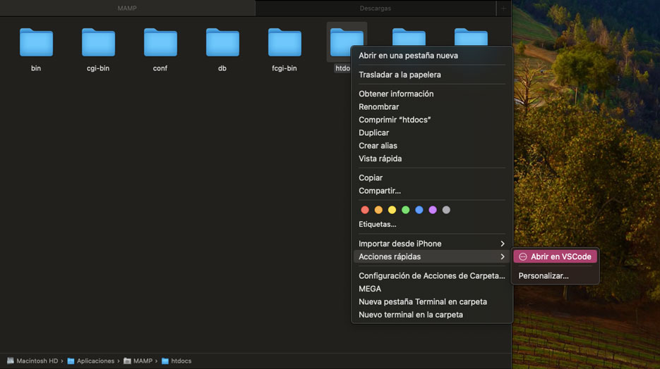

# 🎉 Tutorial: Cómo Crear un Acceso Rápido para Abrir Carpetas en VSCode desde Finder en macOS

## Requisitos 🛠️

- Tener Visual Studio Code (VSCode) instalado.
- Tener el comando `code` disponible en la terminal.

## Paso 1: Instalar VSCode CLI 🚀

1. Abre VSCode.
2. Presiona `Cmd` + `Shift` + `P` para abrir la paleta de comandos.
    
3. Escribe `Shell Command: Install 'code' command in PATH` y selecciónalo.
4. Deberías ver una confirmación de que el comando `code` se instaló correctamente.
    
   ¡Y listo! Ya tienes el comando `code` disponible en tu terminal.


## Paso 2: Crear una Acción Rápida en Automator ⚙️

1. Abre **Automator** (puedes buscarlo en Spotlight 🔍).

    

2. Selecciona **Nuevo Documento**.
3. Elige **Acción rápida** como tipo de documento.

    

4. En la parte superior de la ventana, donde dice "El flujo de trabajo recibe", selecciona `archivos o carpetas` en `Finder`.

    

5. En la biblioteca de la izquierda, busca **Ejecutar AppleScript** y arrástralo al flujo de trabajo a la derecha.

    

6. Reemplaza el contenido del script con el siguiente código, asegurándote de usar la ruta completa al comando `code` (por ejemplo, `/usr/local/bin/code`):

    

    ```applescript
    on run {input, parameters}
        set folderPath to POSIX path of (item 1 of input)
        do shell script "/usr/local/bin/code " & quoted form of folderPath
        return input
    end run
    ```

    

7. Guarda la Acción rápida con un nombre descriptivo como `Abrir en VSCode`.

    

   ¡Y ya tienes tu acción rápida creada! 🥳

## Paso 3: Usar la Acción rápida en Finder 🖱️

1. Abre **Finder** y navega a la carpeta que deseas abrir en VSCode.
2. Haz clic derecho (Ctrl + clic) en la carpeta.
3. En el menú contextual, selecciona `Acciones rápidas` y luego `Abrir en VSCode` (o el nombre que le hayas dado).

    

   ¡Tarán! Ahora puedes abrir cualquier carpeta en VSCode directamente desde Finder. 🎉

## Solución de Problemas 🛠️

Si ves un error indicando que el comando `code` no se encuentra, no te preocupes. Aquí va la solución:

1. Abre **Terminal**.
2. Escribe `which code` y presiona Enter.
3. Anota la ruta que aparece (por ejemplo, `/usr/local/bin/code`).

Asegúrate de que la ruta completa al comando `code` esté especificada en el script de AppleScript en Automator. 

Y eso es todo. ¡Felicidades por configurar tu acceso rápido! Ahora puedes disfrutar de una integración más fluida entre Finder y VSCode. ¡Happy coding! 💻✨